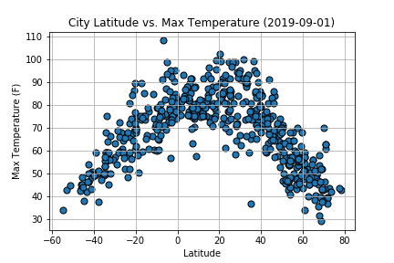
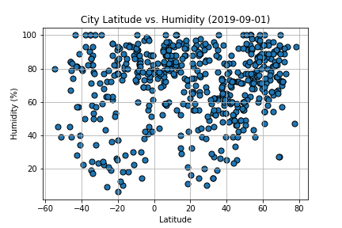
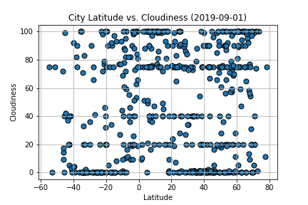
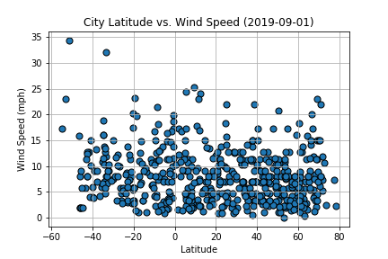

# python-api-challenge

## Requirements
* [OpenWeatherMap API](https://openweathermap.org/api)
* [citipy](https://github.com/wingchen/citipy) Python package

APIs are very useful in gathering data for an analysis. Here, I use the OpenWeatherMap API to gather data to visualize some weather metrics against the latitude of a randomly generated list of 500+ cities. The following relationships are presented:

* Temperature (F) vs. Latitude

* Humidity (%) vs. Latitude

* Cloudiness (%) vs. Latitude

* Wind Speed (mph) vs. Latitude

A CSV file containing all data retrieved as well as PNG images for each plot created are also included.

## Conclusions

* (Latitude vs Temperature) Latitude is parallel to the equator where a value of zero defines the actual equator and the north/south pole have the values +90/-90 degress respectively. As we can see, cities closer to the equator tend to have higher max temperatures at this time of year than those closer to the poles and there is a very smooth pattern going from pole to equator to opposite pole.
Due to the nature of the Earth's rotation, summer time in the northern hemisphere is winter time in the southern hemisphere and vice versa (winter time in the northern hemisphere is summer time in the southern hemisphere). So even though I created this plot in September 2019, it would still look about the same even if I plotted it at any time of the year. In the opposite season, the plot would just be a mirror of itself. However, the plot is an upside quadratic equation (i.e. upside down "U") and the mirror image of that is...itself haha

* (Latitude vs. Humidity) There is a large cluster of cities in this dataset where humidity is higher than 60%. At this time of year, it seems that the nothern hemisphere (i.e. latitude > 0) contains that cluster. This is probably due to it being the summer months in the northern hemisphere and so we have more humidity at this time.

* (Latitude vs Cloudiness) There really seems to be no relationship between latitude and cloudiness according to this plot. It ranges all over the place regardless of where each city is in the world. Therefore, latitude does not seem to have much of an effect on cloudiness.

* (Latitude vs. Wind Speed) Most cities have a wind speed of below 15 mph. Latitude again does not seem to be much of a factor as the wind speed is distributed pretty evenly across all latitudes. There are a few outliers closer to the poles though. Could be exceptions or it might indicate that wind speeds are more extreme at the poles.